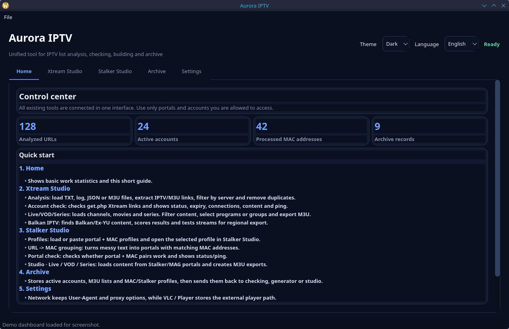

# Aurora IPTV

Objedinjeni desktop paket napravljen od najboljih funkcija svih IPTV alata u
ovom workspaceu. Slabije duple implementacije zamijenjene su zajedničkim
parserima, dok su dva najjača napredna modula sačuvana u punom obliku.

## Screenshot

### Main window



## Funkcije

- učitavanje i dodavanje više `.txt`, `.log`, `.csv`, `.json`, `.m3u` i `.m3u8` datoteka
- URL/M3U extractor: filter, grupiranje po serveru, samo serveri, izvještaj i TXT export
- grupiranje URL → MAC s lokalnim/globalnim uklanjanjem duplikata i TXT exportom
- paralelna Xtream provjera s filtrima i TXT/CSV/JSON/M3U exportom
- autorizirana MAC HTTP provjera kroz query parametar, header ili cookie i CSV export
- Xtream generator za Live, VOD i epizode serija
- zasebni podtabovi i tablice za Live, VOD i Serije
- prijenos podataka između Extractora, skenera, generatora i Stalker Studija
- desni klik za Copy/Paste i kontekstne akcije u tekstualnim poljima i tablicama
- ugrađeni Stalker Studio u istom Aurora prozoru:
  - automatski `portal.php` i `stalker_portal/server/load.php`
  - Live, VOD i TV Shows
  - kategorije i pojedinačni odabir
  - adult PIN, auto threads i brojanje stavki
  - brzi i normalni M3U export
  - resolve stream linkova i provjera nakon exporta
  - slanje odabranog profila iz Balkan MAC testa u Studio desnim klikom
  - dvoklik na kanal generira tokenizirani link i odmah pokreće stream u VLC-u
  - desni klik na kanal nudi pokretanje, kopiranje naziva, odabir i pregled detalja
- ugrađeni Balkan IPTV tab u istom Aurora prozoru:
  - napredni Xtream/MAC skener i Ex-YU/Balkan detekcija
  - export TXT i M3U po regiji
  - status/ping/expiry filtri i ocjenjivanje rezultata
  - random stream testovi
  - uređivač Live/VOD/Serije, EPG i vanjski player
  - Super-lista i Smart Merge
  - proxy, User-Agent i dijagnostika
  - trezor s importom/exportom i ponovnim skeniranjem
- Aurora SQLite arhiva s JSON import/exportom i CSV exportom
- moderno responzivno sučelje s glavnim tabovima, podtabovima i akcijama koje se
  prelamaju u dodatni red tako da tekst gumba ostaje vidljiv na užem prozoru
- automatski update ponovno pokreće aplikaciju tek nakon gašenja stare instance,
  kroz izdvojenu Linux `.sh` ili Windows `.bat` skriptu

## Pokretanje

Skripte automatski:

- pronalaze Python
- instaliraju sve iz `requirements.txt` direktno u pronađeni Python
- pokreću Aurora IPTV

### Linux

```bash
chmod +x run.sh
./run.sh
```

Na KDE/Plasma sustavu možeš i dvaput kliknuti `run.sh`. Skripta će automatski
otvoriti Konsole kako bi instalacija i eventualne greške ostale vidljive.

Ako Dolphin pita što napraviti sa skriptom, odaberi **Execute / Pokreni**.

Najjednostavnije na ovom KDE računalu: dvaput klikni datoteku
`Aurora IPTV.desktop`. Ona uvijek pokreće program u terminalu.

### Windows

Dvaput klikni:

```text
run.bat
```

Ili pokreni iz Command Prompt/PowerShell prozora:

```bat
run.bat
```

Potreban je Python 3.10 ili noviji. Na Windows instalaciji uključi opciju
`Add Python to PATH`.

Koristi samo portale, račune i endpointove za koje imaš dopuštenje.

## GitHub release paketi

GitHub Actions workflow `.github/workflows/release.yml` izrađuje pakete pri pushu
tagova oblika `v*`, npr.:

```bash
git tag v1.0.0
git push origin v1.0.0
```

Release dobiva ove datoteke:

- Windows `.exe`
- Linux `.AppImage`
- Debian/Ubuntu `.deb`
- Linux portable `.tar.gz`
